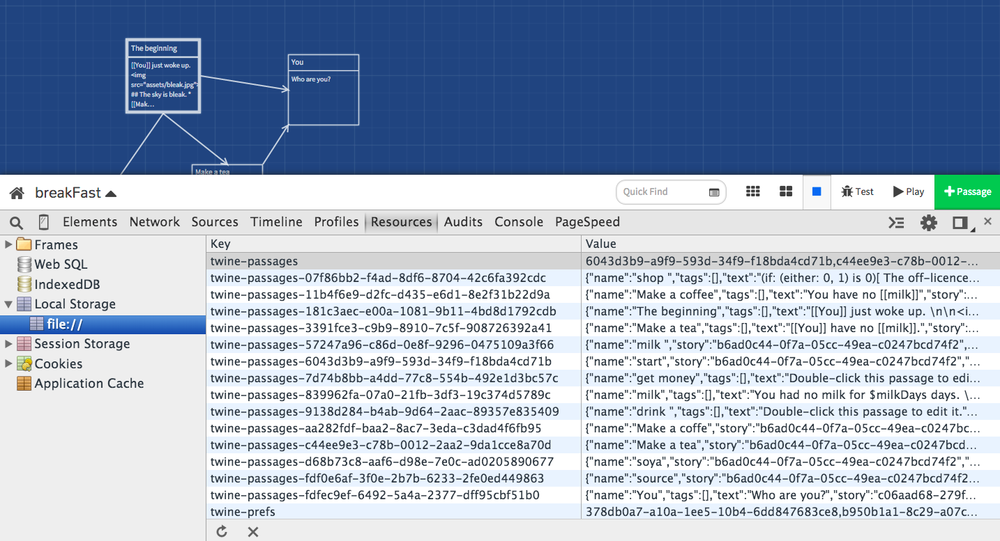

# Session 5

### Today, 14th May 

* [Sort out Git](#sort-out-git)
* [Formative presentations](#formative-presentations)
* [Running a Web server](#running-a-web-server)
* [Saving Twine files](#saving-twine-files)
* [Locative games](#locative-games)

Your [homework](#homework)!

# Sort out Git

### Forking this repository 

1. Log in to [GitHub](https://github.com)
* Go to [github.com/RavensbourneWebMedia/Interactive-Narratives](https://github.com/RavensbourneWebMedia/Interactive-Narratives)
* [**Fork**](https://github.com/RavensbourneWebMedia/Interactive-Narratives#fork-destination-box) it!
* Copy the *HTTPS clone URL* of your new fork, it should look something like `https://github.com/YOUR_NAME/Interactive-Narratives.git`
* Open the [SourceTree](http://www.sourcetreeapp.com/) app
* `File > New / Clone` or `cmd + N`
* `Clone from URL`
	* Paste your *HTTPS clone URL* in the `Source URL`
	* The `Destination Path` should be an *empty* folder on your computer
	* The `Name` can be whatever you want
*	Press `Clone`
*	Once the repository is cloned and downloaded, SourceTree will open up a new window for the repo.

Remember: you will push your work to **your forked repo**, not to the original repo.

### Getting the latest files from the original repo OPTIONAL 

1.	Click on `Settings` (the cog icon on the top-right corner)
* `Remotes` > `Add`
	* `Remote name` can be whatever you want, the convention is to call it `upstream`
	* `URL / path` is `https://github.com/RavensbourneWebMedia/Interactive-Narratives.git`, which is the *HTTPS clone URL* of the original repo
* When `upstream` is added to your SourceTree left sidebar, you can right-click on it and choose `Pull from upstream...`
* This will pull (download) all the latest files from the original repository into your fork.

# Formative presentations

### Teams

1. Margot, Matt and Cal
2. Harry, Simeron and Liam 
3. Kim, Burak and Innocent

### Checklist

These are some questions that you can use to structure your formative presentation. It's not a strict checklist, pick and mix as your team pleases.

* [ ] How did [modding the verbs](session-01.md#hacking-games-with-verbs) of an existing game influence the *story* that the game tells and the *morals* it embodies?
* [ ] How did the [game-stories you analysed](session-01.md#assignment) convey a narrative through an interactive (and possibly playful) experience? What could you *steal* from them?
* [ ] What can [board games](session-02.md#board-games) teach us about storytelling? Think about *role play* (`are you a knight, a trader, a builder?` etc.) and *social play* (`who are you trading with? who are your allies and enemies?` etc.).. 
* [ ] What are the differences between writing a short story and a [twine](session-02.md#twine)?
* [ ] Can [gaming make a better world](http://www.ted.com/talks/jane_mcgonigal_gaming_can_make_a_better_world?language=en#t-464468)?
* [ ] What elements of your mystery story from last term could be told through a *game* (or *games*)?
* [ ] What are your **two game ideas**? Pitch them to us
* [ ] Would you do that with [Twine](session-02.md#twine), [Phaser](session-03.md#phaser), or both?

	 		

# Saving Twine files

Twine saves your work in the browser's [LocalStorage](http://diveintohtml5.info/storage.html).

This means that your *twines* **may be wiped** if you clear your browser's cache! 

To prevent that and safely back your work up:

1. Publish your twines by clicking the `Publish to File` button
	
2. Push your story HTML file plus any linked assets (eg images) to your GitHub repo fork.

If you have images or other media **linked** inside your Twine, make sure that those links are not broken in your published twine. See [here](session-02.md#images).

# Running a Web server

# Locative games

Mashing the GeoLocation API (native to your browser) with Phaser or Twine (or both!) 

Check out [Hear us Here](http://www.hearushereapp.com)

# Homework

Using Phaser (or similar) *remix* an exploration-based game so that it tells **your** [non]linear story through space. The work may have one or more of the following features:

* Broken time-space continuum

* Non stereotypical kind of fantasy. Can you imagine a fantasy world that is not derived from Tolkien, Asimov, Disney?

* Autobiographical (not necessarily a realistic contemporary setting)

* Based in the Greenwich Peninsula (at any point in history)

